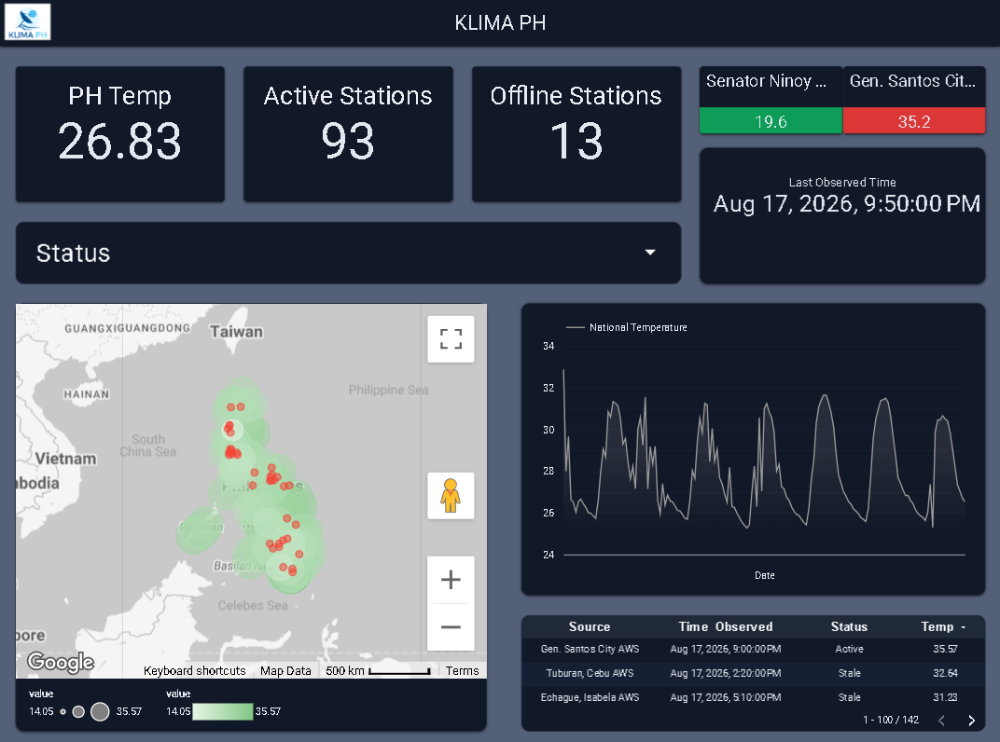
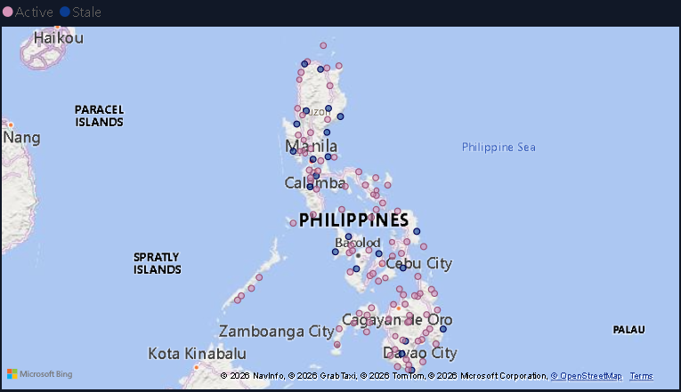
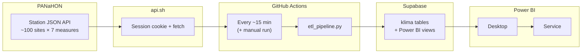
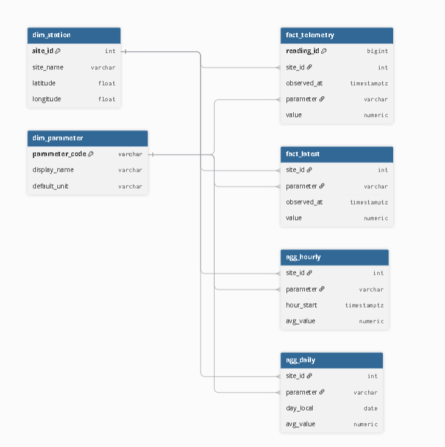

<p align="center">
  
</p>

<p align="center">
  <strong>Kloud-Linked Integrated Meteorological Analytics</strong><br />
  Philippine weather stations → Supabase → Power BI.<br />
  Free-tier pipeline. Updates about every 15 minutes.
</p>

<p align="center">
  <a href="https://github.com/lukegabriel520/KLIMA/actions/workflows/ingest_weather.yml"></a>
  
  
  
</p>

<p align="center">
  <a href="#what-is-klima">About</a> ·
  <a href="#live-dashboard">Dashboard</a> ·
  <a href="#architecture">Architecture</a> ·
  <a href="#quick-start">Quick Start</a> ·
  <a href="#repository-layout">Layout</a> ·
  <a href="#free-tier-limits">Free tier</a> ·
  <a href="#attribution--disclaimer">Attribution</a>
</p>

---

## What is KLIMA?

**KLIMA** (*Kloud-Linked Integrated Meteorological Analytics*) reads live data from Philippine automated weather stations on the public [PANaHON](https://panahon.gov.ph/) map, stores it in Supabase (Postgres), and shows it in Power BI.

| Piece | Role |
|-------|------|
| [`api.sh`](api.sh) | Fetches station JSON from PANaHON |
| [`etl_pipeline.py`](etl_pipeline.py) | Cleans, validates, and loads into the database |
| GitHub Actions | Runs the load on a schedule (public repo runners) |
| Supabase | Holds recent readings plus hourly/daily summaries |
| Power BI | Dashboard (Desktop or Service) |

No paid scheduler. Built to stay on free plans.

---

## Live dashboard

<p align="center">
  <a href="https://app.powerbi.com/groups/me/reports/1b639dfd-37e1-4a87-bf36-6c56d9a2e5bc/c7043a12264684991e27?experience=power-bi"><strong>Open KLIMA in Power BI Service</strong></a>
</p>

> Personal workspace link. Sign-in may be required. Screenshots below are for visitors without access.

<p align="center">
  
</p>

<details>
<summary><strong>KPI strip · Map</strong></summary>

<p align="center">
  
</p>

<p align="center">
  
</p>

</details>

---

## Architecture



### Measures each run

`rainfall` · `temperature` · `heat-index` · `humidity` · `pressure` · `wind-speed` · `wind-direction`

### How long data is kept

| Layer | Keep |
|-------|------|
| Raw readings (`fact_telemetry`) | 48 hours |
| Hourly summaries (`agg_hourly`) | 30 days |
| Daily summaries (`agg_daily`) | 365 days (Asia/Manila calendar day) |

<p align="center">
  
</p>

### Cleaning rules

- Times from the API are treated as **Asia/Manila**, stored as **UTC**
- Temperature / heat-index / humidity `0` → empty (bad sensor)
- Rainfall `0` kept (no rain is valid)
- Wind like `WNW (303.1°)` → degrees only
- One row per station + time + measure

---

## Quick Start

**You need:** Python 3.11+, `curl`, bash (Git Bash on Windows), a free Supabase project, Power BI Desktop (for the dashboard).

### 1. Clone & install

```bash
git clone https://github.com/lukegabriel520/KLIMA.git
cd KLIMA
python -m venv .venv
# Windows: .venv\Scripts\activate
source .venv/bin/activate
pip install -r requirements.txt
```

### 2. Database schema

In the Supabase **SQL Editor**, run the full file:

[`supabase/migrations/20260810150000_klima_star_schema.sql`](supabase/migrations/20260810150000_klima_star_schema.sql)

That creates the `klima` tables, views, and the `klima_readonly` login used by Power BI.

### 3. Local secrets

```bash
cp .env.example .env
```

Set `SUPABASE_DB_URL` to the **transaction** pooler URL (port **6543**) with `sslmode=require`. See [`.env.example`](.env.example).

Never commit `.env`.

### 4. Dry run, then live load

```bash
# Windows only — point at Git Bash so api.sh can run
export KLIMA_BASH="/c/Program Files/Git/bin/bash.exe"

DRY_RUN=1 python etl_pipeline.py
python etl_pipeline.py
```

Check health in Supabase:

```sql
SELECT * FROM klima.vw_health;
```

### 5. Tests

```bash
pytest tests/ -q
```

### 6. GitHub Actions

Repo **Settings → Secrets and variables → Actions**:

| Secret | Value |
|--------|--------|
| `SUPABASE_DB_URL` | Same transaction pooler URL as local |

Workflow: [`.github/workflows/ingest_weather.yml`](.github/workflows/ingest_weather.yml)  
Manual run: **Actions → AWS Weather Data Pipeline → Run workflow**

### 7. Power BI

Full steps: [`powerbi/CONNECTION.md`](powerbi/CONNECTION.md).

| Field | Value |
|--------|--------|
| Server | Supabase **session** pooler host (port `5432`) |
| Database | `postgres` |
| User | `klima_readonly.<project_ref>` |
| Mode | **Import** |
| Objects | `klima.vw_powerbi_latest` · `vw_powerbi_hourly` · `vw_powerbi_daily` |

Set the read-only password once (SQL Editor):

```sql
ALTER ROLE klima_readonly WITH PASSWORD 'YOUR_STRONG_PASSWORD';
```

Extras: [`powerbi/measures.dax`](powerbi/measures.dax) · [`powerbi/klima-theme.json`](powerbi/klima-theme.json) · [`powerbi/DASHBOARD_LAYOUT.md`](powerbi/DASHBOARD_LAYOUT.md)

---

## Repository layout

```text
KLIMA/
├── api.sh                          # Fetches station JSON
├── etl_pipeline.py                 # Clean → load → retention
├── requirements.txt
├── .env.example
├── .github/workflows/ingest_weather.yml
├── supabase/migrations/            # Schema, views, grants
├── powerbi/                        # Connection, DAX, theme, queries
├── tests/                          # Transform tests
├── scripts/load_env.py             # Local .env helper
└── docs/
    ├── SCREENSHOTS.md              # Media inventory
    └── assets/                     # README images (PNG)
```

---

## Free-tier limits

| Limit | How KLIMA handles it |
|-------|----------------------|
| Supabase Free ~500 MB; idle pause | Short retention; scheduled loads keep the project active |
| No point-in-time recovery on Free | Schema lives in git migrations |
| Private repo Action minutes | Prefer a **public** repo |
| Schedules can drift or pause after long idle | Off-peak cron + occasional manual runs |
| Power BI Free has no public “Publish to web” | Desktop + Service for signed-in users |

Built for free tiers — not a guaranteed production SLA.

---

## Attribution & disclaimer

> Values come from **PAGASA PANaHON** automatic weather stations ([panahon.gov.ph](https://panahon.gov.ph/)). Official archives may need a formal request and have redistribution limits. KLIMA uses the public map API for personal / educational use. Gaps and sensor faults happen. **Not an official PAGASA product.** Do not use as operational forecast guidance.

---

## Docs & media

| Path | Purpose |
|------|---------|
| [`docs/assets/`](docs/assets/) | Logo, architecture, schema, dashboard screenshots |
| [`docs/SCREENSHOTS.md`](docs/SCREENSHOTS.md) | Final image inventory |
| [`powerbi/`](powerbi/) | Dashboard connection and layout |

---

## License / ethics

Code here is for learning and personal analytics. Respect PAGASA terms if you redistribute raw weather data.
